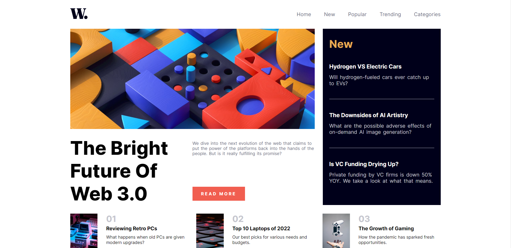

# Frontend Mentor - News homepage solution

This is a solution to the [News homepage challenge on Frontend Mentor](https://www.frontendmentor.io/challenges/news-homepage-H6SWTa1MFl). Frontend Mentor challenges help you improve your coding skills by building realistic projects.

## Table of contents

- [Overview](#overview)
  - [The challenge](#the-challenge)
  - [Screenshot](#screenshot)
  - [Links](#links)
- [My process](#my-process)
  - [Built with](#built-with)
  - [What I learned](#what-i-learned)
  - [Continued development](#continued-development)
  - [Useful resources](#useful-resources)
- [Author](#author)

**Note: Delete this note and update the table of contents based on what sections you keep.**

## Overview

### The challenge

Users should be able to:

- View the optimal layout for the interface depending on their device's screen size
- See hover and focus states for all interactive elements on the page

### Screenshot

### Links

- Solution URL: [Add solution URL here](https://your-solution-url.com)
- Live Site URL: [Add live site URL here](https://your-live-site-url.com)

## My process

### Built with

- Semantic HTML5 markup
- CSS custom properties
- Flexbox

### What I learned

The major things I have learned while developing the website is that layouting the whole webiste using flex box and making it responsive.
Moreover, I have learnt how to make the font size responsive using calc() and vw.

### Continued development

I think I need to be good at both grid and flexbox. It would be better if grid is used to layout the website. Currently, I have used flexbox to layout the whole website.

### Useful resources

- [Example resource 1](https://developer.mozilla.org/) - This website help me understand more things on html css and js. I have read a lot on the site while I don't understand the things very well. It assists a lot while developing.

## Author

- Website - [Ye Myint Kyaw](https://github.com/YairMyintKyaw)
- Frontend Mentor - [@YzzzK](https://www.frontendmentor.io/profile/YzzzK)
